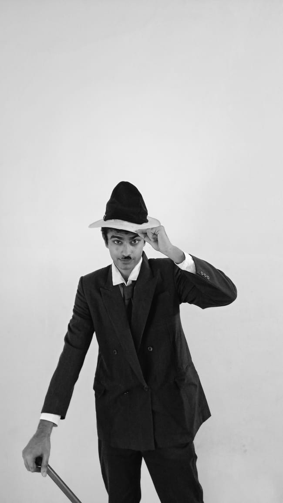

Hi Bud, 

Welcome to my space on the Internet!

*Bonjour!   (Me dressing up as Chaplin, just to kill time during the Great Quarantine)*

My name is **Jithin James** (*but you can call me JJ* ) and I'm a Computer Science student from Kerala. 
I love to code and build things and I'm also super exicted about machine learning and AI.
I like to think a lot about how to improve Deep Learning algorithms and learning about new frontiers in AI.
Right now, I work on building and scaling ML systems to help people do better or automate their everyday tasks so they have more time to do whay they love.
I'm learning more about building ML systems and workflows that manage and scale data pipelines, training and inferencing of machine learning models. 

I prefer `Neovim`, `i3`, `tmux` in my software development and I tend to prefer tools like these becouse of how effective they make my workflow.

When I'm not sitting in front of my computer, I'm probably riding my motorbike and I love it!
I love travelling, meeting new people and having new experiences.
It broadens your views about the world and makes you more emphatic (you also have a shit load of fun, obviously!).
I'm also into photography and love films.
(*I have some blogs lined up about my travels and photography, so check this space later to read them*)


